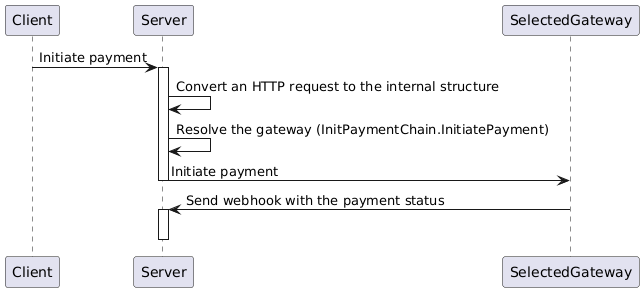

## Brief

Execute the following commands in the same order:

```text
Run server:

go run main.go

Init payment (a request from the client to our server):

curl -XPOST -d '{"currency":"AED", "id": "6b77a7bc-0bee-49ab-bbb0-70d5245a20f7", "amount_fractions":99999}' http://localhost:8080/init-payment -i

Webhook for the payment status (a request from the gateway to our server):

curl -XPOST -d '{"external_id":"my-payment-gateway-json-id-123", "status":"paid"}' http://localhost:8080/external/json-webhook -i

Refund (a request from the client to our server):

curl -XPOST -d '{"id": "6b77a7bc-0bee-49ab-bbb0-70d5245a20f7"}' http://localhost:8080/refund -i
```

## Architecture overview



## Basic docs

Usually, we could have something like a swagger file, due to limited time, I have to provide a simpler version:

### Init request

`POST /init-payment`

```json
{
  "currency": "AED",
  "id": "6b77a7bc-0bee-49ab-bbb0-70d5245a20f7", // UUID generated on the client side, unique per request
  "amount_fractions": 99999                     // to avoid precision errors we convert the amount to the most basic units (e.g. for 100.99 AED we convert that to fills - 10099)
}
```

### Webhook

`POST /external/json-webhook`

The webhook will differ for different gateways, here we have a basic implementation of our mock service.

```json
{
  "external_id": "my-payment-gateway-json-id-123", // ID used by the gateway
  "status": "paid"                                 // status
}
```


### Refund

The refund request

`POST /refund`

```json
{
  "id": "6b77a7bc-0bee-49ab-bbb0-70d5245a20f7" // payment ID in our DB
}
```

## Overview

### usecases/payment

Transport agnostic endpoints (that we could use reuse for any other transport, e.g. RabbitMQ, SQS, gRPC).

### usecases/payment/transport_http.go

Bridges between the HTTP and the internal structures.

### gateways

Implementations of particular gateways

### gateways/*_chain.go

"Multi" gateway implementation. It aggregates many gateways and depending on the error rate,
and whether the given endpoint supports the given request (e.g. we have one gateway for USD, another one for AED)
calls the selected one.

### gateways/circuit_breaker.go

A simple circuit breaker implementation to determine which endpoint we want to use.

## To improve

1. Naming convention
2. Implement mock soap gateway (due to limited the body has been ignored, but in the main.go, I left a comment how to inject that once it's implemented)
3. DB - due to limited time I decided to mock the DB using "in memory" storage. Since we use interfaces, we can easily replace that the proper implementation.
4. Distributed lock - it's mocked, the proper interface should be injected or we could lock the row in the DB.
5. Add opentracing wherever it's missing/required (example `payments/usecases/payment/tracing.go`).
6. Cover everything by tests - I tried to show all possibilities of using tests - mocking http server, having table tests, parallel tests, and so one, but I could not cover everything in the given time.
7. Queues - instead of sending requests to gateways in realtime we could use queues, it would allow us for re-queueing, and make the solution more robust.
8. Handle more error codes, and return meaningful messages, currently we return 400 and 500 only.
